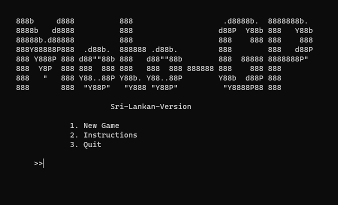

# 🏍️ Moto-GP - Text-Based Adventure 🏍️

Welcome to **Moto-GP**, a thrilling text-based adventure created by a team of talented developers. Join us on this exciting journey as we race through the world of coding and creativity!

## 🌟 Meet the Team 🌟

Meet the brilliant minds behind this project:

- [Ushan Ikshana](https://github.com/im-ushan-ikshana) 🚀
- [Pulindu](https://github.com/psw101) 🎮
- [Enuka](https://github.com/chanuthenuka) 🛠️
- [Kesara](https://github.com/kesarakulathunga) 🧩

## 📚 Included Libraries and Functions 📚

- `iostream`: Input and output handling.
- `conio.h`: Console input/output functions (specific to Windows).
- `windows.h`: Windows-specific functions for console manipulation.
- `cstdlib`: Standard C library for various utility functions.
- `string` and `cstring`: String manipulation and handling.
- Custom-defined functions for game setup, menu display, player input, game logic, and more.

## 🎮 Game Introduction 🎮

**Moto-GP** is an exhilarating text-based adventure where you control a high-speed motorcycle on a thrilling journey through various levels. Your objective is to navigate obstacles and collect points as you progress through the game. Be careful not to collide with the enemy bike, or it's game over!

## 🏁 How to Play 🏁

- **W**: Accelerate and jump.
- **S**: Perform an instant brake.
- **A**: Move left.
- **D**: Move right.
- **X**: Force stop and quit the game.

## 🚀 Get Started 🚀

1. Clone this repository to your local machine.
2. Compile and run the code using your C++ compiler.
3. Follow the on-screen instructions to play the game.

## 🔓 Open Source 🛡️

This project is open source, and we encourage contributions and improvements from the community. Feel free to fork the repository, make enhancements, and submit pull requests to make the game even more awesome!

🎉 Have a blast playing **Moto-GP**! 🎉
